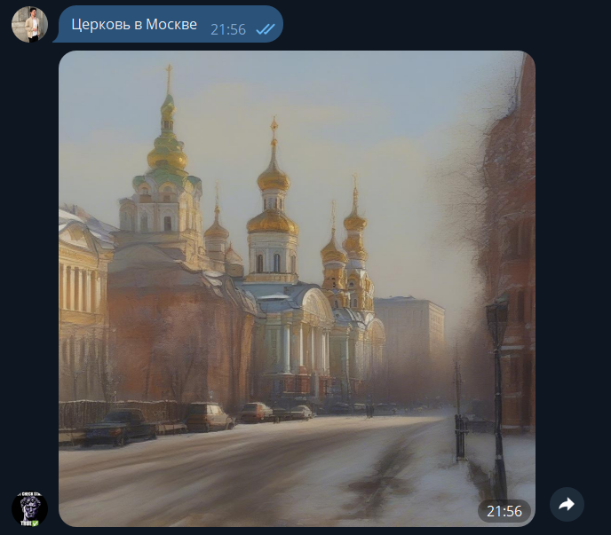

# Telegram-бот для генерации изображений на основе текста с использованием Stable Diffusion XL

Этот репозиторий содержит код Telegram-бота, который позволяет создавать изображения на основе текстовых описаний с использованием модели `stable-diffusion-xl-base-1.0` из Hugging Face.

## 🚀 Функциональность

Бот генерирует изображения на основе пользовательских текстовых описаний. Алгоритм работы следующий:

1. **Ввод текста:** Пользователь отправляет текстовое описание в чат с ботом.
2. **Обработка запроса:** Telegram-бот отправляет запрос на сервер FastAPI, который вызывает модель `stable-diffusion-xl-base-1.0` для генерации изображения.
3. **Возврат результата:** Бот отправляет сгенерированное изображение обратно пользователю.

## 🛠️ Требования

- Python 3.12+
- Установленные зависимости из файла `requirements.txt`.

## 📦 Установка и настройка

1. **Клонируйте репозиторий:**
   ```bash
   git clone https://github.com/ArtakOvakimyan/ai_tg-text-to-image
   cd ai_tg-text-to-image
2. **Установите зависимости:**
   ```bash
   pip install -r requirements.txt
3. **Настройте переменные окружения:**
- Создайте файл .env
- Укажите токен вашего Telegram-бота и бота HuggingFace, аналогично примеру из .env_example
- Убедитесь, что URL FastAPI-сервера указан правильно.

4. **Запустите сервер FastAPI:**
   ```bash
   fastapi run .\model\model_api_wrapped.py
5. **Запустите скрипт Telegram-бота:**
   ```bash
   python bot/bot.py

## 🔍 Компоненты проекта

- **Telegram-бот:** Отвечает за взаимодействие с пользователями, отправку и получение данных.
- **FastAPI-сервер:** Обрабатывает запросы от бота и взаимодействует с моделью.
- **Модель Stable Diffusion XL:** Преобразует текстовые описания в изображения.

## Пример работы


