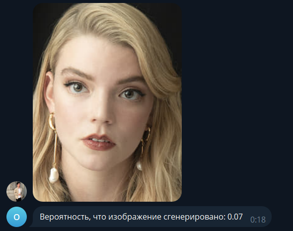
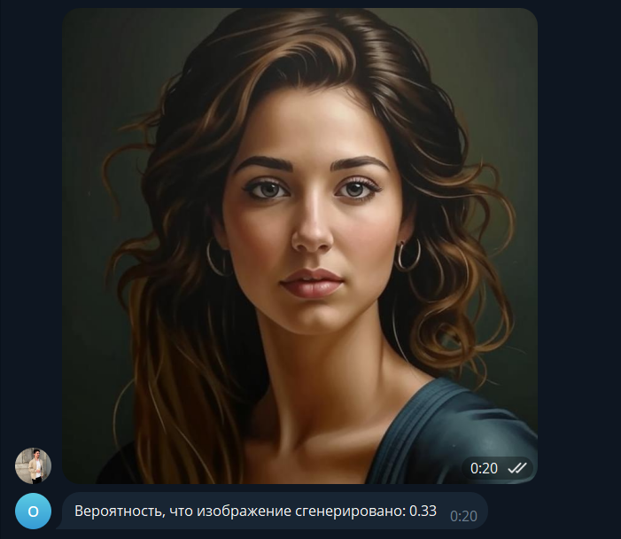

# Telegram-бот для обнаружения изображений, сгенерированных нейросетями

Этот репозиторий содержит код для Telegram-бота, который определяет, вероятно ли, что изображение было сгенерировано нейросетев. Бот использует модель классификации изображений `Organika/sdxl-detector` из Hugging Face.

## Функциональность

Бот отвечает на загрузку изображений в чатах Telegram. При получении изображения он выполняет следующие действия:

1. **Загрузка изображения:** Бот загружает полученное изображение и записывает его в io-буфер.
2. **Выполнение вывода:** Предварительно обработанное изображение передаётся модели `Organika/sdxl-detector` для классификации. Модель выдает вероятностный балл, представляющий собой вероятность того, что изображение было сгенерировано.
3. **Отправка результата:** Бот отправляет пользователю сообщение, содержащее вероятностный балл. Более высокий балл указывает на более высокую вероятность того, что изображение сгенерировано нейросетью.

## Требования

• `Python 3.12+` \
• `requirements.txt`

## Пример работы

