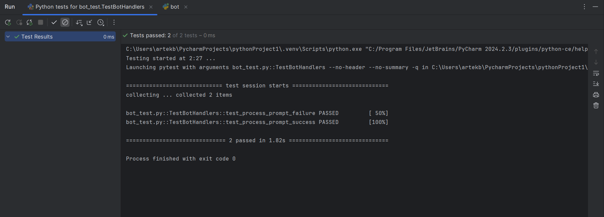
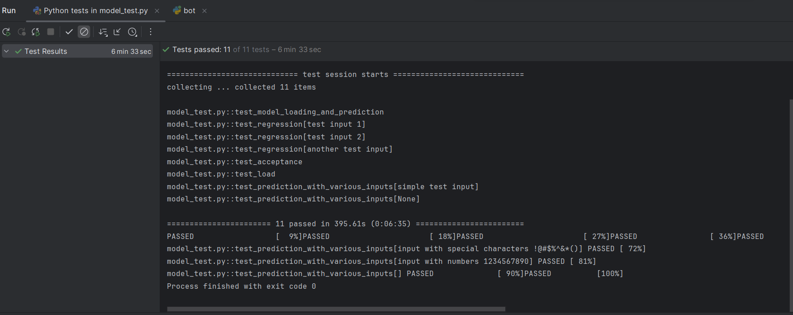

# Отчет о результатах тестирования

## Интеграционные тесты (test_model_loading_and_prediction)
•  **Цель**: Проверка корректной работы API при отправке валидного запроса.

•  **Детали**: Тест отправляет POST-запрос на эндпоинт /process с простым тестовым сообщением и проверяет, что:
-  Сервер возвращает код ответа 200 (успешно).
-  Ответ приходит в виде изображения (тип image/png).
-  Содержимое ответа не пустое.

•  **Замечания**: Все проверки успешны, говорит о правильной интеграции компонентов системы и корректном функционировании API.

## Регрессионные тесты (test_regression)
•  **Цель**: Проверка стабильности работы API с различными тестовыми вводами.

•  **Детали**: Тест параметризован и отправляет POST-запросы с тремя разными текстовыми сообщениями.

•  **Замечания**: API корректно обрабатывает разные входные данные, а также продолжает возвращать ответы в ожидаемом формате.

## Приемочные тесты (test_acceptance)
•  **Цель**: Проверка соответствия API приемочным критериям.

•  **Детали**: Тест проверяет:
  -  Корректную обработку валидного ввода (код 200 и изображение в ответе).
  -  Возврат кода 422 (ошибка валидации) при некорректном вводе (неправильный ключ запроса).
  -  Корректную обработку пустого ввода (код 200 и непустой ответ).

•  **Замечания**: API корректно ведет себя в различных ситуациях и соответствует требованиям к обработке корректных и некорректных входных данных.

## Нагрузочные тесты (test_load)
•  **Цель**: Проверка стабильности и производительности API под нагрузкой.

•  **Детали**: Тест отправляет 10 последовательных запросов с одинаковым тестовым сообщением и проверяет, что все ответы получены с кодом 200 и содержат изображение.

•  **Замечания**: API способен выдерживать небольшую нагрузку, при этом возвращая корректные ответы. Задержки и кеширование обрабатываются на стороне API Telegram.

## Параметризованные тесты (test_prediction_with_various_inputs)
•  **Цель**: Проверка работы API с различными типами вводимых данных, включая специальные символы, числа, пустую строку и None.

•  **Детали**: Тест параметризован и отправляет запросы с разными входными значениями.
  -  Ожидается код 200 при валидном вводе и 422 при None.
  
•  **Замечания**: Тест подтвердил, что API корректно обрабатывает как валидные входные данные, так и случаи некорректного ввода.

## Модульные тесты (TestBotHandlers)
•  **Цель**: Тестирование логики обработки запроса бота.

•  **Детали**:
  -  test_process_prompt_success: Проверяет, что при успешном ответе от API, бот отправит изображение пользователю. Используются моки для запросов к API и телеграмму.
  -  test_process_prompt_failure: Проверяет, что при ошибке от API, бот отправит сообщение об ошибке. Используются моки.
  
•  **Замечания**: Тесты покрыли основные сценарии работы обработчика запросов, показывая правильное поведение в различных ситуациях.

## Общие замечания
-  Все тесты проходят, говорит о стабильной работе.
-  Функция make_request_with_retries обрабатывает возможные ошибки 500, отправляя повторные запросы с паузой.
-  Код тестов хорошо покрывает функциональность API, а так же модуль обработки бота.

## Выводы
На основании тестирования можно сделать вывод, что API для генерации изображений по текстовым запросам и модуль бота работают корректно. Тесты показали, что API стабилен при различных типах входных данных, выдерживает небольшую нагрузку, корректно обрабатывает ошибки. Модульные тесты также подтвердили стабильность работы обработчика запросов.

## Рекомендации:
-  Для более полного тестирования можно добавить тесты с более высокими нагрузками и различными типами сообщений, например с длинным текстом, а также с более сложным и нетипичным запросом.
-  Возможно добавить тесты для других возможных API эндпоинтов и сценариев.
-  Провести дополнительное тестирование безопасности.
